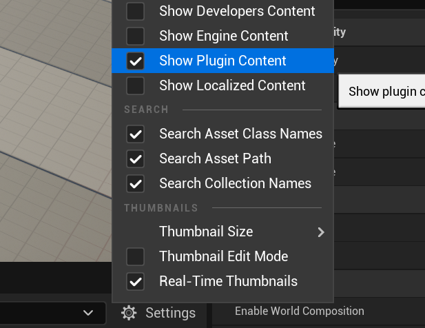

# VCCSim

VCCSim is a plugin for simulating robots(Drone and Car) in Unreal Engine 5.

*Attention: This work is still in early development and may not be stable. Please use it with caution.*

## Development Environment

For now, we are using the following development environment.

We recommend using the same environment to avoid compatibility issues.

- Unreal Engine 5.4.2
- JetBrains Rider 2024.3.5 (Attention: we still need Visual Studio for essential development environment)
- Windows 11 (We are not sure if it works on other platforms)

## HOW TO USE

### Server

1. Clone the core code.

    Clone this repository to your Unreal Engine 5 project's `Plugins` directory.

   For clone the submodules simultaneously, we recommend using the command below to clone the repository.

   ```bash
    git clone --recurse-submodules https://github.com/Marmiya/VCCSim
    ```

    If you have already cloned the repository without the `--recurse-submodules` option, you can clone the submodules with the command below.

    ```bash
    git submodule update --init --recursive
    ```

2. Setup the GRPC.

    Download the [GRPC for VCCSIM](https://drive.google.com/file/d/11rhmTjRyMszTzqDrmTah0v8Zu6GyfrNo/view?usp=drive_link)

   After downloading the file, extract it to the `Source` directory.

   You can also build the GRPC by yourself. But it is a bit complicated. The compiled result usually cannot be used directly with UE. So we recommend using our precompiled version.

    We will provide a guide for building the GRPC with UE5 by yourself soon.

3. Build the project.

    Right click on the `.uproject` file and select `Generate Visual Studio project files`.

   *If an unexpected error occurred, we recommend deleting the `Intermediate` and `Saved` directories and trying again.*

    Then open the `.sln` file with your IDE(Visual Studio or JetBrains Rider).

    If you can see the `VCCSim` in the "Plugins" directory in the Explorer, you have successfully cloned the repository. For now, you can build the project and open the editor.

4. Settings in editor

    Check the `Show Plugin Content` in the `View Options` to see the plugin content.

    

    For now, you can see the `VCCSim` directory in the `Content` directory.

    

    In order to control the map, you need to set the `Game Instance Class` as `BP_VCCSimGameInstance` in the `Project Settings`.

    For each map you want to use the VCCSim, you need to set the `Game Mode Override` as `BP_VCCSimGameMode`.

5. Set experiment settings

    VCCSim uses the 'RSConfig.toml' file to set the experiment settings.

    The default place of 'RSConfig.toml' file is `/Plugins/VCCSim/Source/VCCSim`. But you can change the path in the `YourUser/VCCSim` directory.